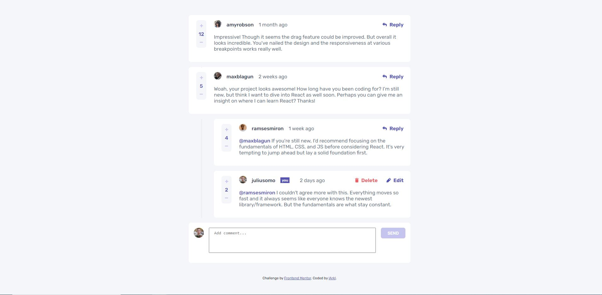

# Frontend Mentor - Interactive comments section solution

This is a solution to the [Interactive comments section challenge on Frontend Mentor](https://www.frontendmentor.io/challenges/interactive-comments-section-iG1RugEG9). Frontend Mentor challenges help you improve your coding skills by building realistic projects. 

## Table of contents

- [Overview](#overview)
  - [The challenge](#the-challenge)
  - [Screenshot](#screenshot)
  - [Links](#links)
- [My process](#my-process)
  - [Built with](#built-with)
  - [What I learned](#what-i-learned)
  - [Continued development](#continued-development)
  - [Useful resources](#useful-resources)
- [Author](#author)

**Note: Delete this note and update the table of contents based on what sections you keep.**

## Overview

### The challenge

Users should be able to:

- View the optimal layout for the app depending on their device's screen size
- See hover states for all interactive elements on the page
- Create, Read, Update, and Delete comments and replies
- Upvote and downvote comments
- **Bonus**: If you're building a purely front-end project, use `localStorage` to save the current state in the browser that persists when the browser is refreshed.
- **Bonus**: Instead of using the `createdAt` strings from the `data.json` file, try using timestamps and dynamically track the time since the comment or reply was posted.

### Screenshot



### Links

- Solution URL: [https://www.frontendmentor.io/solutions/mobile-first-with-react-HJeWTmpfc](https://www.frontendmentor.io/solutions/mobile-first-with-react-HJeWTmpfc)
- Live Site URL: [https://larkl.github.io/fm-interactive-comments-section/](https://larkl.github.io/fm-interactive-comments-section/)

## My process

### Built with

- Semantic HTML5 markup
- CSS custom properties
- Flexbox
- CSS Grid
- Mobile-first workflow
- [React](https://reactjs.org/) - JS library

### What I learned

This challenge let me learn some CSS techniques and practice responsiveness concepts taking a mobile-first approach. For example, using grid template areas to order additional section tags, as text area above the image and SEND / REPLY button and change its display to flex for big screens.

```css
.additional {
  background: var(--white);
  border-radius: 0.5rem;
  display: grid;
  margin: 1rem;
  grid-template-areas: "text text"
                       "img  button";
  padding: 1rem;
}
```

```css
@media ... {
  section > .additional {
    display: flex;
    justify-content: space-between;
    gap: 1rem;
  }
}
```

Learned to format date difference as text with RelativeTimeFormat:

```js
const rtf1 = new Intl.RelativeTimeFormat("en", { style: "narrow" });

...

rtf1.format(difference, "day");
```


### Continued development

* Change updating flow to be more readable.
* Use context to stop prop drilling.
* Improve performance.

### Useful resources

- [CSS Grid](https://css-tricks.com/snippets/css/complete-guide-grid/) - This helped me to remember grid options when thinking how to tackle responsiveness.

## Author

- Frontend Mentor - [@lArkl](https://www.frontendmentor.io/profile/lArkl)
